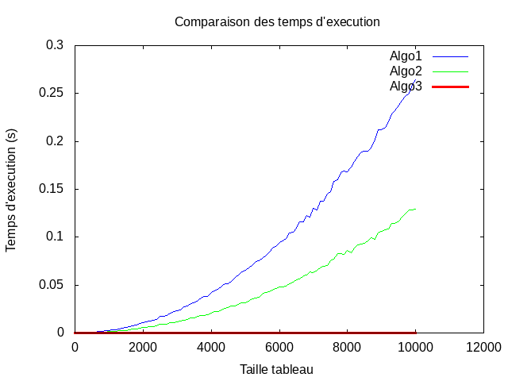
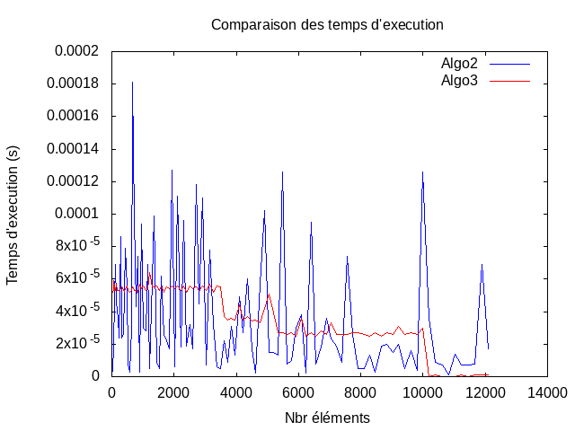

# Mini Projet 1 : Outils de débogue, tableaux et complexité

## Exo 1 : Utilisation d'outils de débogue
 
### Partie 1 : Pb avec l'indice de boucle

#### Q1.1
- A la lecture du programme on suppose qu'il doit:
    - Allouer l'espace pour un tableau de 10 entiers.
    - Remplir ce tableau en partant de la fin par la valeur de son indice.(À rebour, commence a 9 puis fini a 0)
    - Libérer l'espace alloué dynamiquement via la commande malloc précédemment.
- Compilation, execution et retour:
    ```bash
    gcc -o tme1_exo1p1 tme1_exo1p1.c && ./tme1_exo1p1
    Segmentation fault (core dumped) 
    ```
    - On constate que la compilation se passe sans encombre mais qu'a l'exécution le programme plante car il essaye
      d'acceder à une zone mémoire non précédemment alloué: `Segmentation fault`

#### Q1.2
- Recompilation avec l'option -ggdb puis utilisation de l'outil gdb:

```bash
gcc -ggdb -o tme1_exo1p1 tme1_exo1p1.c && gdb tme1_exo1p1
```
- Une fois dans gdb on introduit le point d'arret à la ligne 13 puis on lance avec la commande run
- Afin de voir ce qu'il se passe, on alterne les commandes `continue` et `print i` pour suivre la variable i
- On constate alors que tout se passe bien jusqu'a ce qu'on atteigne la valeur 0:
    - le pas de boucle suivant applique une décrémentation de 1 a 0 ce qui devrait retourner -1 mais on constate que la
      valeur de i=4294967295, soit la valeur maximale d'un entier non signé.
    - La sortie de boucle ne se fait pas car le condition n'est pas respectée.
    - Cela génére une erreur car nous n'avions alloué que 10 cases au tableau et là il essaye d'accéder à la case
      t[4294967295].

#### Q1.3
- Pour résoudre ce problème il suffit donc d'enlever le mot clé `unsigned`.On constate alors que cela resoud l'erreur.

### Partie 2 : Pb d'allocation mémoire

#### Q1.4
- A la lecture du programme on suppose qu'il doit:
    - Utiliser la fonction `creer_adresse` qui :
        - alloue dynamiquement l'espace necessaire pour la structure adresse
        - affectation des valeurs aux differents attributs de cette structure
        - puis retourne le pointeur vers l'instance de la structure ainsi créée
    - Affiche les valeurs de l'instance d'adresse crée.
- Compilation, execution et retour:
    ```bash
    gcc -o tme1_exo1p2 tme1_exo1p2.c && ./tme1_exo1p2
    Segmentation fault (core dumped) 
    ```
    - Meme constat que précédemment.(cf Q1.1)

#### Q1.5
```bash
...
15	    strcpy(new->rue, r);
(gdb) p new->rue
$1 = 0x0
(gdb) c
Continuing.

Program received signal SIGSEGV, Segmentation fault.
__strcpy_sse2_unaligned () at ../sysdeps/x86_64/multiarch/strcpy-sse2-unaligned.S:668
668	../sysdeps/x86_64/multiarch/strcpy-sse2-unaligned.S: No such file or directory.
...
```
- constate que l'erreur survient à l'execution de la commande `strcpy`, cela pourrait venir du fait que la taille de la
  destination(new->rue) ne soit pas suffisante pour acceuillir la source(r).
- Pour corriger cela on alloue dynamiquement l'espace necessaire de la cible.
    ```bash
    ...
    new->numero = n;
    new->rue= (char*) malloc(sizeof(strlen(r)+1));
    strcpy(new->rue, r);
    ...
    ```
    Puis penser dans le main a tout libérer (ou faire fonciton pour ca)
    ```bash
    ...
    free(maison->rue);
    free(maison);
    ```

### Partie 3 : fuite mémoire

#### Q1.6
- A la lecture du programme on suppose qu'il doit:
    - Initialise une structure tableau contenant un tableau d'entier tableau->tab de taille 100 via la fonction
      `initTableau` qui:
        - alloue dynamiquement l'espace necessaire pour la structure tableau
        - affectations des valeurs des differents attributs de cette structure
        - alloue dynamiquement l'espace necessaire pour l'attribut tableau->tab
        - puis retourne le pointeur vers l'instance de la structure ainsi créée
    - Ajout de 5 éléments via la fonction `ajouterElement` qui:
        - ajoute a la derniére position du tableau l'element a passé en argument
        - incrémente l'attribut tableau->position (correspond au dernier indice du tableau->tab)
    - Affiche le tableau ainsi crée et modifié via la commande `affichageTableau`
- Compilation, execution et retour:
    ```bash
    gcc -o tme1_exo1p3 tme1_exo1p3.c && ./tme1_exo1p3
    t->position = 5
    [ 5 18 99999 -452 4587 ]
    ```
    - Contrairement aux questions précédentes, l'execution ne génére pas d'erreur.

#### Q1.7 
- Au vue du titre de la partie et à la lecture du programme on peut en déduire que le problème de ce programme est la
  fuite de mémoire. En effet, malgrés deux mallocs dans la fonction `initTableau` on ne voit qu'un `free(...)`.

#### Q1.8
- Utilisation de valgrind:
```bash
valgrind --leak-check=yes ./tme1 exo1p3
==12996== Memcheck, a memory error detector
==12996== Copyright (C) 2002-2017, and GNU GPL'd, by Julian Seward et al.
==12996== Using Valgrind-3.13.0 and LibVEX; rerun with -h for copyright info
==12996== Command: ./tme1_exo1p3
==12996== 
==12996== 
==12996== HEAP SUMMARY:
==12996==     in use at exit: 400 bytes in 1 blocks
==12996==   total heap usage: 3 allocs, 2 frees, 1,440 bytes allocated
==12996== 
==12996== 400 bytes in 1 blocks are definitely lost in loss record 1 of 1
==12996==    at 0x4C31B0F: malloc (in /usr/lib/valgrind/vgpreload_memcheck-amd64-linux.so)
==12996==    by 0x108793: initTableau (in /home/trollo974/gdv/TME1_2/tme1_exo1p3)
==12996==    by 0x10883D: main (in /home/trollo974/gdv/TME1_2/tme1_exo1p3)
==12996== 
==12996== LEAK SUMMARY:
==12996==    definitely lost: 400 bytes in 1 blocks
==12996==    indirectly lost: 0 bytes in 0 blocks
==12996==      possibly lost: 0 bytes in 0 blocks
==12996==    still reachable: 0 bytes in 0 blocks
==12996==         suppressed: 0 bytes in 0 blocks
==12996== 
==12996== For counts of detected and suppressed errors, rerun with: -v
==12996== ERROR SUMMARY: 1 errors from 1 contexts (suppressed: 0 from 0)
```
- On constate que des fuites mémoires sont détéctées, les 400bytes correspondent à l'espace alloué pour lL'attribut
  tableau->tab correspondant à un tableau de 5 entiers

#### Q1.9
- Pour corriger ce probleme on peut créer une fonction qui libére l'espace du tableau d'entier puis de la structure:
```bash
...
void libereTableau(Tableau *t){
	free(t->tab);
	free(t);
}

int main(){
	Tableau* t;
	t = initTableau(100);
	ajouterElement(5,t);
	ajouterElement(18,t);
	ajouterElement(99999,t);
	ajouterElement(-452,t);
	ajouterElement(4587,t);
	affichageTableau(t);	
	libereTableau(t);
}
```

## Exo 2 : Algorithme et tableaux
 
### Partie 1 : Tableau à une dimension

#### Q2.1 - Creation des fonctions:
- `int* alloue_tab(int n)`
- `void alloue_tableau(int **T,int n)`
- `void desalloue_tableau(int *T)`
- `void remplir_tableau(int *T, int t, int n)`
- `void afficher_tableau(int *T, int t)`

#### Q2.2 - Creation des fonctions:
- `int somme_carre_difference(int *T, int t)` : Version suivant la formule donnée.
- `int som_car_dif(int *T, int t)` : Version limitant les calculs à la matrice triangulaire .
- `int scd(int *T, int t)` : Version de meilleur complexité en supprimant l'imbrication des deux boucles for.

#### Q2.3 - Calcul et affichage du temps pris par les methodes
- exo2p1a.c permet de visualiser le résultat avant utilisation de gnuplot, voici le retour de valgrind:
```bash
Les valeurs du tableau sont comprises entre [0, 100[.
[Taille tableau|Valeur trouvée|  Temps1  |  Temps2  |  Temps 3  ]
[            1 |            0 |  0.000004|  0.000003|  0.000006 ]
[           10 |       121540 |  0.000004|  0.000003|  0.000003 ]
[          100 |      7641451 |  0.000103|  0.000052|  0.000003 ]
[         1000 |    863710876 |  0.009747|  0.004733|  0.000005 ]
[        10000 |  82935707164 |  0.260068|  0.130243|  0.000031 ]
==11519== 
==11519== HEAP SUMMARY:
==11519==     in use at exit: 0 bytes in 0 blocks
==11519==   total heap usage: 6 allocs, 6 frees, 45,468 bytes allocated
```

- exo2p1b.c incrémente de maniére continue la taille du tableau et enregistre les resultats dans un fichiers puis utilise
  gnuplot pour générer un graphique permettant de visualiser le temps de calcul des differents algorithmes= complexité
  temporelle.:
  - 
  - La courbe algo1 correspond a la fonction `somme_carre_difference(int *T, int t)` ayant deux boucles for calculant
    l'ensemble des combinaisons possibles, on a donc une complexité O(n²) où ~(3*n)²+1 opérations élémentaire sont effectuées.
  - La courbe algo2 correspond a la fonction `som_car_diff(int *T, int t)` ayant deux boucles for calculant uniquement
    les combinaisons differentes, on a donc une complexité O(n²) où ~(3*(n-1))²/2 opérations élémentaire sont effectuées.
  - La courbe algo3 correspond a la fonction `scd(int *T, int t)` ayant une unique boucle for.On a donc une complexité
    ~O(n) où 2*n+2 opérations élémentaire sont effectuées.
 
### Partie 2 : Tableau à deux dimensions (matrices)

#### Q2.4 - Creation des fonctions:
- Dans le fichier `./exo2p2a.c` on créé les fonctions suivantes:
    - `int** alloue_matrice(int n)`
    - `void desalloue_matrice(int **M, int n)`
    - `void remplir_matrice(int **M, int n, int v)`
    - `void afficher_matrice(int **M, int n)`

- Dont le valgrind retourne :
    ```bash
    ...
    [ 14, 19, 53, 80, 95, 97]
    [ 62,  0, 78, 89, 17, 39]
    [ 24, 53,  8, 27, 27, 66]
    [ 79, 48, 30, 71, 34, 23]
    [ 79, 23, 49, 79, 20, 83]
    [ 88, 34,  2, 93, 66, 49]
    ==7747==
    ==7747== HEAP SUMMARY:
    ==7747==     in use at exit: 0 bytes in 0 blocks
    ==7747==   total heap usage: 8 allocs, 8 frees, 1,360 bytes allocated
    ...
    ```

#### Q2.5 - Determiner si les éléments d'une matrice sont différents
- Dans le fichier `exo2p2a.c` on ajoute les fonctions:
    - `void remplir_indice(int **M, int n, int v)`: remplissant une matrice par ses indices => matrice dont les éléments
      sont forcement différent, permet de tester les autres fonctions crées.
    - `int check_elements_differents(int **M, int n)`: retourne 0 si tous les élements sont différents, 1 sinon et fait
      toujours le pire des cas => pas de return quand trouvé => complexité 0(n^4)
- Modification du main qui retourne:
    ```bash
    [  4,  5,  7,  2]
    [  8,  0,  1,  5]
    [  0,  8,  2,  6]
    [  9,  9,  0,  8]
    Les elements de la matrice NE sont PAS tous differents
    [  0,  1,  2,  3]
    [  4,  5,  6,  7]
    [  8,  9, 10, 11]
    [ 12, 13, 14, 15]
    Les éléments de la matrices SONT tous differents
    ```
- On améliore la fonction en utilisant un tableau d'une dimension (de taille V) nommé "grille" et dont on initialise les
  case à la valeur -1.On parcour ensuite notre matrice, et pour chaque case de celle-ci, on modifie la valeur du tableau
  grille à l'indexe correspondant ainsi si dans la grille la valeur est négative, c'est la première fois que l'on
  rencontre cette valeur, sinon c'est un doublons => sortie de boucle.
  Ainsi dans le pire des cas on parcours une fois la grille et une fois la matrice soit une complexité de O(V)+O(n²) VS
  O(n^4)

- 
- Interprétation des résultats:
    - On observe que l'algo3, courbre représentant l'algo-optimiser présente un coup constant, liés a la complexité de
      la grille O(V), mais que ses variations sont assez faible comparer à l'algo2.
    - La courbe Algo2 a une variation assez importante de ses temps d'execution, cela est due au remplissage aléatoire
      qui peut souvent placé asser tot deux élément identiques, cependant on observe qu'en abscence de chance, cad qd on
      temps vers le pire des cas, le temps d'execution est trés éloigné de l'algo2.
    - On peut aussi observer que lorsque le nombre d'élément depasse celui de la borne supérieur, l'algo3 ne fait aucun
      calcul est determine qu'il y a forcement un doublons.

#### Q2.6 - Produit matrices carrées
- Dans le fichier `exo2p2b.c` on récupére les fonctions:
    - `int** alloue_matrice(int n)`
    - `void desalloue_matrice(int **M, int n)`
    - `void remplir_matrice(int **M, int n, int v)`
    - `void afficher_matrice(int **M, int n)`
- Auxquelles on ajoute les fonctions:
    - `int **produit_matrice_carre(int **m1, int**m2, int n)`: retourne la matrice produit des deux matrices carrées
      passées en argument.

- L'execution du programme retourne:
    ```bash
    ...
    [  3,  6]
    [  7,  5]
    
    [  3,  5]
    [  6,  2]
    
    [ 45, 27]
    [ 51, 45]
    ==31891==
    ==31891== HEAP SUMMARY:
    ==31891==     in use at exit: 0 bytes in 0 blocks
    ==31891==   total heap usage: 10 allocs, 10 frees, 1,168 bytes allocated
    ...
    ```

