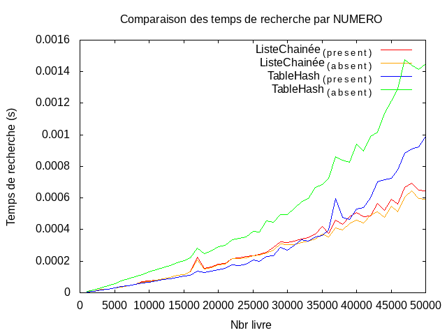

# TME3_4 : Mini-Projet 2 : Gestion d'une bibliothèque

## Exo1 : Gestion d'une bibliothèque avec une liste chaînée de struct

### Q1.1 : Creation des fichiers
- `biblioLC.c` : contient les fonctions permettant de gérer les listes chainées.
- `biblioLC.h` : header contenant signatures des fonctions et structures propre à la table de hachage.
### Q1.2 : Creation fonctions manipulation des structures
- `Livre* creer_livre(int num, char *titre, char *auteur)` :  ~O(1) : copie les arguments, alloue l'espace necessaire
  puis crée l'instance de Livre correspondant et retourne le pointeur vers cette instance de Livre.
- `void liberer_livre(Livre *l)` : ~O(1) : libére les champs de l'instance de Livre passée en argument.
- `Biblio* creer_biblio()` :   ~O(1) : alloue l'espace necessaire puis crée l'instance de Biblio vide (champ b->L=NULL)
  puis retourne le pointeur vers cette intance.
- `void liberer_Biblio(Biblio* b)` : ~O(n) où n est la taille de la liste chainée : parcoure l'ensemble de la liste
  chainée afin de libérer tous ses éléments, puis libére le pointeur vers b avant de mettre la valeur du pointeur vers
  l'entéte de la liste Chainée a NULL(utilisé par la fonction affichage pour determiner si bilbio vide ou non existante)
- `void inserer_en_tete(Biblio* b, int num, char *titre, char *auteur)` : ~0(1) : insére un Livre en téte de la liste
  chainée.
### Q1.3 : Creation fonctions manipulation de fichiers
- `Biblio* charger_n_entreesLC(char * nom_fichier, int nb_ligne )` : créer un instance de Biblio en lisant les
  *<nb_ligne>* premières lignes du fichier *<nom_fichier>*
- `void enregistrer_bilbioLC(Biblio* b, char *nom_fichier)` : Enregistre la bilbio *<b>* dans le fichier *<nom_fichier>*
### Q1.4 : Creation du mainLC.c
- La commande `make LC` permet la compilation de `mainLC.c` et produit le binaire `mainLC`.
- Ainsi la commande `./mainLC GdeBiblio.txt 5000` commence par créer une biblio à partir des 5000 premiéres lignes du
  fichier GdeBiblio.txt puis affiche le panel des commandes disponible à l'utilisateur:
### Q1.5 : Creation du Makefile
- Voici les commandes actuelles du makefile:
    - `make testLC`: compile puis test (y compris les fuites memoires avec `valgrind`) l'ensemble des fonctions de manipulation des Listes Chainées.
    - `make testH`: compile puis test (y compris les fuites memoires avec `valgrind`) l'ensemble des fonctions de manipulation des tables de hachages.
    - `make LC`: compile le mainLC permettant de lancer le menu pour l'utilisateur : `make LC && ./mainLC GdeBiblio.txt
      5000` crée une instance de Biblio à partir des 5000 premiéres lignes du fichier GdeBiblio.txt puis affiche le menu
      des actions possibles pour l'utilisateur.
    - `make H`: compile le mainH permettant de lancer le menu pour l'utilisateur : `make H && ./mainH GdeBiblio.txt
      5000` crée une instance de Biblio à partir des 5000 premiéres lignes du fichier GdeBiblio.txt puis affiche le menu
      des actions possibles pour l'utilisateur.
    - `make clean`: permet de supprimer les binaires produits par les commandes ci-dessus

### Q1.6 : Ajout de fonctions utiles
- ` void afficher_livre(Livre *l);` :  ~O(1) Affiche le contenue d'une struct Livre
- ` void afficher_biblio(Biblio* b);` : ~O(n) Parcoure la liste chainée de taille n et affiche via la fonction afficher_livre chaque
  cellule (livre) qui la compose
- ` Livre* search_by_num(Biblio* b, int num);` :  ~O(n) Recherche (par son attribut num) et retourne le Livre d'une
  Biblio, retourn NULL si pas trouvé.
- `Livre* search_by_title(Biblio* b,char *title)` : ~O(n) Recherche (par son attribut titre) et retourne le Livre d'une
  Biblio, retourn NULL si pas trouvé.
- `Livre* search_by_autor(Biblio* b,char *auteur)`: ~O(n) Recherche (par son attribut auteur) et retourne le Livre d'une
  Biblio, retourn NULL si pas trouvé.
- `Biblio* same_autor(Biblio* b,char *autor)` : ~O(n) Retourne la biblio contenant tous les ouvrages de l'auteur passé
  en agument.
- `void supprimer_ouvrage(Biblio* b, int num, char *titre, char *auteur);` ~O(n) Supprime en parcourant la liste toutes
  les occurences de Livre correspondant aux 3arguments de la fonction.(prend aussi en compte les éléments contigues)
- `Biblio *fusion(Biblio* b1, Biblio* b2);` ~O(m) où m est ma taille de la liste chainée de b2 : Ajoute b2 à la suite de
  b1 puis supprime b1.
- `void add_if_new(Biblio* b,int num, char *titre, char *auteur);` ~O(n) crée puis ajoute en queue un livre uniquement
  s'il n'est pas deja présent dans la bibliothèque.
- `Biblio* recherche_doublons(Biblio* b)` : ~O(n²) parcoure la bibliothèque à la recherche des doublons(meme auteur et
  meme titre), puis les regroupents dans une bibliotheque qu'elle retourne.

### Q1.{7,8} : main interactif
- La commande `make H && ./mainH GdeBiblio.txt 5000` crée une instance de Biblio à partir des 5000 premiéres lignes du
  fichier GdeBiblio.txt puis affiche le menu suivant:

```bash
...
Voici vos choix:
- 0 : Quitter le programme
- 1 : Afficher la bibliothèque
- 2 : Créer puis inserer en tete un livre
- 3 : Chercher un livre via son numero
- 4 : Chercher un livre via son titre
- 5 : Créer une bibliotheque contenant tous les ouvrages d'un auteur
- 6 : Supprimer un ouvrage
- 7 : constituer une bibliotheque des doublons(sauvegarde possible)
```

## Exo2 : Gestion d'une bibliothèque avec une table de hachage

### Q2.1 : Creation des fichiers:
- `biblioH.c` : contient les fonctions permettant de gérer la table de hachage.
- `biblioH.h` : header contenant signatures des fonctions et structures propre à la table de hachage.

### Q2.2 : Creation de la fonction:
- `int fonctionClef(char *auteur)` : ~O(1) : retourne la somme des valeurs ASCII de chaque lettre du nom de l'auteur.

### Q2.3 : Creation des fonctions:
- `LivreH* creer_livre(int num, char *titre, char *auteur)` :  ~O(1) : copie les arguments, alloue l'espace necessaire
  puis crée l'instance de LivreH correspondant puis retourne le pointeur vers cette instance de LivreH.
- `void afficher_livre(LivreH *l);` :  ~O(1) Affiche le contenue d'une struct LivreH
- `void liberer_livre(LivreH *l)` : ~O(1) : libére les champs de l'instance de LivreH passée en argument.
- `BiblioH* creer_biblio(int m)` : ~O(m) : alloue l'espace necessaire puis crée l'instance de BiblioH ayant un tableau
  de Livre de taille m.
- `void afficher_biblio(BiblioH* b)` : ~O(n) Parcoure les listes chainées de la table de hash et affiche via la fonction
  afficher_livre chaque element(voir Q2.6 pour rendu)
- `void liberer_biblio(BiblioH* b)` : ~O(n) parcoure l'ensemble des listes chainée de la table de hash afin de libérer
  tous ses éléments.

### Q2.4 : Creation de la fonction:
- `int fonctionHachage(int cle, int m)`: ~0(1) applique la fonction de hachage à la cléf pour une table de hachage de
  taille m.
    
### Q2.5 : Creation de la fonction:
- ` void inserer(BiblioH* b, int num, char *titre, char *auteur)`: ~O(1) insére en téte de liste chainée l'ouvrage créer
  à partir des arguments.(incrémente le champ b->nE pour garder le compte de livre à jour)

### Q2.6 : Creation des fonctions:

#### PARTIE entreeSortiesH.c
- `BiblioH* charger_n_entreesH(char * nom_fichier, int nb_ligne, int taille_table)` : ~O(1) à partir des *<nb_ligne>* 1er
  lignes du fichier *<nom_fichier>*, créer une instance de BilbioH ayant une table de hash de taille *<taille_table>*
- `void enregistrer_bilbioH(BiblioH* b, char *nom_fichier)`: ~O(1) enregistre dans le fichier *<nom_fichier>* la biblioH.

- Le test de ces deux fonctions:
    ```c
    ...
    BiblioH* b2 = charger_n_entreesH("GdeBiblio.txt", 10, 10);
    afficher_biblio(b2);
    enregistrer_bilbioH(b2,"saveH.txt");
    liberer_biblio(b2);
    ```
- retourne :
```bash
     ...
     _____
    |  T  |
    |-----|
    |   0 | --> (7,SOFS,cnuvqhffbsaq)->Null
    |   1 | --> (9,KMLNOZJKPQPXR,xkitzyxa)->(5,JIVSWMDKQT,xixmvtrr)->Null
    |   2 | --> Null
    |   3 | --> Null
    |   4 | --> (4,FWKHOPKMCOQHNWNKUE,hsqmgbbuqcl)->Null
    |   5 | --> (8,WPQCA,ehchzvf)->(0,WLRBBMQBHCDARZOWK,yhidd)->Null
    |   6 | --> (6,LJPTNSNFWZQFJMA,adrr)->Null
    |   7 | --> Null
    |   8 | --> (3,KEZXDU,xdrwv)->(2,JYBLD,efsarcbynecd)->(1,SCDXRJ,owfrx)->Null
    |   9 | --> Null
    '-----'
    ==8119==
    ==8119== HEAP SUMMARY:
    ==8119==     in use at exit: 0 bytes in 0 blocks
    ==8119==   total heap usage: 37 allocs, 37 frees, 10,772 bytes allocated
    ...
```
- et créé le fichier `saveH.txt` suivant :
```txt
7 SOFS cnuvqhffbsaq
9 KMLNOZJKPQPXR xkitzyxa
5 JIVSWMDKQT xixmvtrr
4 FWKHOPKMCOQHNWNKUE hsqmgbbuqcl
8 WPQCA ehchzvf
0 WLRBBMQBHCDARZOWK yhidd
6 LJPTNSNFWZQFJMA adrr
3 KEZXDU xdrwv
2 JYBLD efsarcbynecd
1 SCDXRJ owfrx
```

#### PARTIE biblioH.c
- ` LivreH* search_by_num(BiblioH* b,int num)` : ~O(n) parcour l'ensemble de la table de hash à la recherche d'un livre
  en fonction de son num.
- ` LivreH* search_by_title(BiblioH* b,char * titre)` : ~O(n) parcour l'ensemble de la table de hash à la recherche d'un
  livre en fonction de son num.
- ` LivreH* search_by_autor(BiblioH* b,char * auteur)` : ~O(m) où m est la taille de la liste chainée des éléments ayant
  le meme indexe dans la table de hachage. Parcoure la liste chainée se trouvant à l'indexe, puis retourne le livre s'il
  est présent, sinon retourne NULL
- ` BiblioH* same_autor(BiblioH* b,char *autor)` : ~O(m), comme precedemment, on ne s'interesse qu'a une seul liste
  chainée, celle se trouvant à l'indexe correspondant a l'auteur passé en argument (en effet, tout auteur ayant le meme
  nom aura la meme cle, et donc pour une table de meme taille le meme indexe).A chaque ouvrage de l'auteur rencontrée,
  on crée une copie qui est ajoutée à l'instance de BilbioH qui sera ensuite retournée (cette instance contient une
  table de hachage de taille 1)
- ` supprimer_ouvrage(BiblioH* b, int num, char *titre, char *auteur)` : _~O(i*m)_ ou i est le nombre d'occurence du
  livre à supprimer et m la taille de la liste chainée de tous les ouvrages ayant le meme indexe que celui à supprimer.
  (comme precedemment, prend en compte les occurences mutliples et contigues)
- ` fusion(BiblioH* b1, BiblioH* b2)` : ~O(2 x (b2->nE + b2->m)) on parcoure l'ensemble des éléments de b2 que l'on insére
  dans b1 (car les tailles de leurs tables de hash, et donc leurs indexes peuvent etre differents), puis on libére la
  memoire de b2
- ` add_if_new(BiblioH* b, int num, char *titre, char *auteur)` : ~O(m) ou m et la taille de la liste chainée de tous
  les ouvrages ayant le meme indexe que le livre à ajouter : parcoure l'ensemble de cette liste, puis s'il n'y est pas
  deja, créer puis insére en queue le livre correspondant aux arguments de la fonction.
- `BiblioH* recherche_doublons(BiblioH* b)` : ~O(n²) deux ouvrages identiques se trouvant forcement dans la meme liste
  chainée de la table de hash (car mm clef => mm indice du tableau).  on cherche donc uniquement dans chaque listes
  chainées du tableau. La bilbioH retournée elle ne contiendrat qu'une case dans son tableau car on ne demande qu'une
  liste chainée en retour.

## Exo3 : Comparaison des deux structures

### Q 3.1 comparer les temps de recherche sur les deux structures (ListeChainée vs TableHash)
- Creation du fichier `compareSearchTime.c` dont le main permet la creation des fichiers suivant:
    - `compareSearchByNum.txt` qui grace à gnuplot génére le graphique `searchByNum.png`
#### Recherche par numero 
- 
- OBSERVATIONS:
    - pour le pire des cas (livre absent), la table de hachage est toujours la plus lente.
    - lorsque le livre existe la table de hachage a des temps du meme ordre de grandeur que la liste chainée, mais passé
      un certains nombre de livre, elle devient moins interessante (au alentour de 5000 ouvrages)
    - La Liste chainée est donc, dans le cas d'une recherche par numero, la structure la plus adaptée pour un grand nombre d'ouvrage (meilleur
      temps et plus simple à mettre en place)
